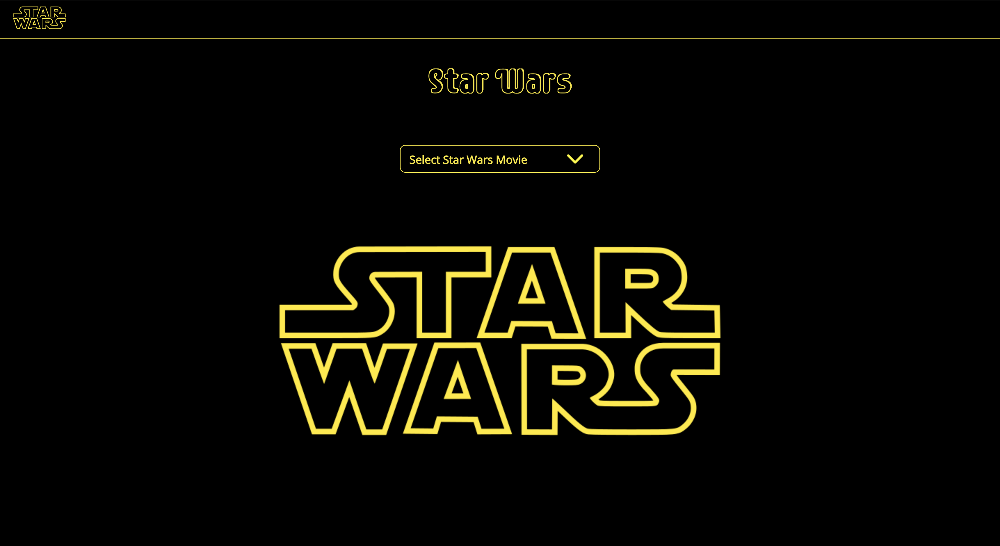

## Pstk Swapi Challenge

 

Link to Pivotal Tracker: https://www.pivotaltracker.com/n/projects/2415802

Link to application: https://pstk-swapi-challenge.netlify.com/

## Built With

<ul>
<li><a href="https://reactjs.org">React</a></li>
<li><a href="https://redux.js.org/">Redux</a></li>
<li><a href="https://www.styled-components.com/">Styled-Components</a></li>
<li><a href="https://swapi.co/api/">Swapi API</a></li>
</ul>

## Testing Tools

<ul>
<li><a href="https://jestjs.io/">Jest</a></li>
<li><a href="https://airbnb.io/enzyme/">Enzyme</a></li>
</ul>

## Getting Started

<h3>Prerequisites</h3>
You need Nodejs Installed to be able to run this project on your machine.

<h3>Installing<h3>
<ul><li>Clone Repository</li></ul>
<pre><code>git clone https://github.com/Easybuoy/pstk-swapi-challenge</code> </pre>
 
 

<ul><li>Change directory to Swapi Challenge</li></ul>
<pre><code>cd pstk-swapi-challenge</code></pre>
 
 

<ul><li>Install Dependencies</li></ul>
<pre><code>npm install</code></pre>
 
 

<ul><li>Start Application</li></ul>
<pre><code>npm start</code></pre>
 
 

<ul><li>Run Test</li></ul>
<pre><code>npm test</code></pre>
 
 

<ul><li>Run Coverage Report</li></ul>
<pre><code>npm run coveralls</code></pre>
 

## License

<h4>This project makes use of the MIT License which can be found <a href="https://github.com/Easybuoy/pstk-swapi-challenge/master/LICENSE">here</a></h4>
